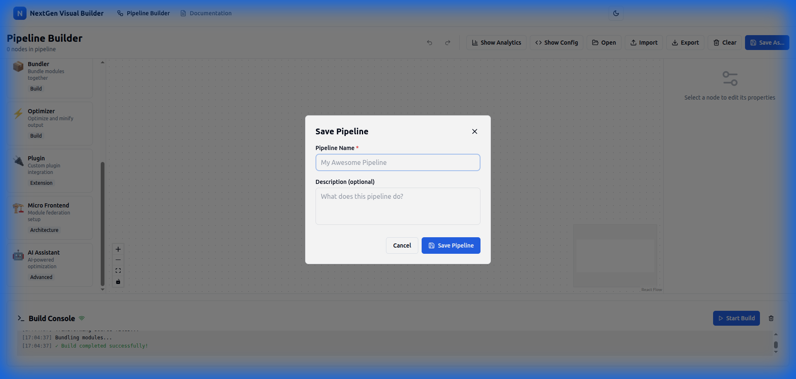

# Quick Start

Build your first project with NextGen in just **5 minutes**! This guide will walk you through creating a complete build pipeline from scratch.

## What You'll Build

By the end of this guide, you'll have:
- ✅ A working NextGen project
- ✅ A visual build pipeline with 3 nodes
- ✅ A development server with hot reload
- ✅ A production-ready build output

Let's get started! 🚀

---

## Step 1: Create Your Project

Open your terminal and run:

```bash
npm create @nextgen/app my-first-app
```

**You'll see:**
```
✔ Select a framework: › React
✔ Use TypeScript? › Yes
✔ Add ESLint? › Yes

Creating project at ./my-first-app...

✓ Project created
✓ Dependencies installed (122 packages)
✓ Git initialized

Done! Now run:
  cd my-first-app
  npm run dev
```

**Navigate to your project:**
```bash
cd my-first-app
```

**Your project structure:**
```
my-first-app/
├── src/
│   ├── App.tsx           # Main React component
│   ├── index.tsx         # Entry point
│   └── index.css         # Styles
├── public/
│   └── index.html        # HTML template
├── nextgen.config.js     # NextGen configuration
├── package.json
└── tsconfig.json
```

---

## Step 2: Start the Development Server

```bash
npm run dev
```

**Output:**
```
NextGen Build Tool v1.0.0

  ➜  Local:   http://localhost:3000
  ➜  Network: http://192.168.1.5:3000
  ➜  UI:      http://localhost:3000/__nextgen

  ready in 156ms
  
🔥 Hot Module Replacement enabled
📦 Building...
✓ Build completed in 234ms
```

**Open your browser:**
- **App**: http://localhost:3000
- **Visual Builder**: http://localhost:3000/__nextgen

You should see the default React app running:


---

## Step 3: Open the Visual Pipeline Builder

Navigate to the Visual Builder UI:

```
http://localhost:3000/__nextgen
```

You'll see the main interface with four panels:


1. **Node Library** (left) - Available build nodes
2. **Canvas** (center) - Your build pipeline
3. **Property Panel** (right) - Node configuration
4. **Build Console** (bottom) - Build output and logs

---

## Step 4: Create Your First Pipeline

Let's build a simple pipeline: **Resolve** → **Transform** → **Bundle**

### 4.1 Add a Resolver Node

1. Find the **Resolver** node in the left panel (🔍 icon)
2. **Drag it** onto the canvas
3. Drop it anywhere on the canvas


The Resolver node handles module path resolution and dependency discovery.

### 4.2 Add a Transformer Node

1. Find the **Transformer** node (⚙️ icon)
2. Drag it onto the canvas
3. Place it to the right of the Resolver


The Transformer compiles/transpiles your code (JSX, TypeScript, etc.).

### 4.3 Add a Bundler Node

1. Find the **Bundler** node (📦 icon)
2. Drag it onto the canvas
3. Place it to the right of the Transformer


The Bundler combines modules into optimized bundles.

### 4.4 Connect the Nodes

Now connect them in order:

1. **Click and hold** the small circle on the **right** of the Resolver node (output)
2. **Drag** to the circle on the **left** of the Transformer node (input)
3. **Release** to create the connection
4. **Repeat** to connect Transformer → Bundler


**Your pipeline should look like this:**
```
Resolver → Transformer → Bundler
```

---

## Step 5: Configure Each Node

Click on each node to configure it in the Property Panel (right side).

### Configure Resolver

Click the **Resolver** node. In the Property Panel, set:

```
Base URL: ./src
Extensions: .tsx, .ts, .jsx, .js
Alias: {
  "@": "./src",
  "@components": "./src/components"
}
```

**What this does:**
- Looks for modules in the `src` directory
- Resolves TypeScript and JavaScript files
- Creates path aliases for cleaner imports

### Configure Transformer

Click the **Transformer** node. Configure:

```
Loader: esbuild
Target: es2020
JSX: automatic
Source Maps: true
```

**What this does:**
- Uses esbuild for fast transpilation
- Targets modern JavaScript (ES2020)
- Enables React's automatic JSX runtime
- Generates source maps for debugging

### Configure Bundler

Click the **Bundler** node. Set:

```
Format: esm
Code Splitting: ✓ enabled
Minify: ✓ enabled (for production)
External Dependencies: react, react-dom
```

**What this does:**
- Outputs ES modules
- Splits code for better performance
- Minifies for smaller bundles
- Keeps React external (loaded from CDN)

---

## Step 6: Save Your Pipeline

1. Click **Save As** in the top toolbar
2. Name it: "React Development Pipeline"
3. Add description: "Basic React build with hot reload"
4. Click **Save**



Your pipeline is now saved and will auto-load next time!

---

## Step 7: Test Hot Module Replacement

Let's see hot reload in action:

1. **Keep the dev server running** (from Step 2)
2. **Open** `src/App.tsx` in your editor
3. **Change** the text in the component:

```tsx
function App() {
  return (
    <div>
      <h1>Hello NextGen! 🚀</h1>
      <p>Hot reload is working!</p>
    </div>
  )
}
```

4. **Save the file**
5. **Watch your browser** - it updates instantly without refresh!

**In the Visual Builder console, you'll see:**
```
[HMR] File changed: src/App.tsx
[HMR] Updating module...
✓ Hot reload completed in 42ms
```

---

## Step 8: Build for Production

When you're ready to deploy, create an optimized production build:

### Via Visual Builder

1. Open the Visual Builder (http://localhost:3000/__nextgen)
2. Click **Start Build** in the bottom panel
3. Watch the build progress in real-time

### Via CLI

Or use the command line:

```bash
npm run build
```

**Output:**
```
NextGen Build Tool v1.0.0

Building for production...

✓ Resolving modules... (47 modules found)
✓ Transforming... (47 files processed)
✓ Bundling... (3 chunks created)
✓ Optimizing... (minified + tree-shaken)

Build completed in 1.2s

Output files:
  dist/index.html        2.3 KB
  dist/main.js          245.2 KB  (gzip: 78.4 KB)
  dist/vendor.js       156.8 KB  (gzip: 51.2 KB)
  dist/main.css          12.4 KB  (gzip: 3.1 KB)
  
Total size: 414.4 KB (gzip: 132.7 KB)
```

**Your build output:**
```
dist/
├── index.html
├── main.js
├── main.js.map
├── vendor.js
├── vendor.js.map
└── main.css
```

---

## Step 9: Preview Production Build

Test your production build locally:

```bash
npm run preview
```

**Output:**
```
NextGen Build Tool v1.0.0

  ➜  Local:   http://localhost:4173
  ➜  Network: http://192.168.1.5:4173

Serving production build from ./dist
```

Open http://localhost:4173 to see your production build in action.

---

## Step 10: Explore Advanced Features

Now that you have a working pipeline, explore more features:

### Undo/Redo

Made a mistake? Use keyboard shortcuts:
- **Ctrl+Z** (or Cmd+Z on Mac) - Undo
- **Ctrl+Y** (or Cmd+Y) - Redo

Try it:
1. Delete a node from your pipeline
2. Press **Ctrl+Z** - it's back!
3. Press **Ctrl+Y** - it's gone again!

### State Inspector (Debug Tool)

Press **Ctrl+Shift+D** to open the State Inspector:


Features:
- View complete application state
- Time-travel through history
- Export/import pipeline state
- Debug state changes

### Auto-Save

NextGen automatically saves your pipeline every 5 seconds. You'll see the save status in the top-right:

- 🟢 **Saved** - All changes persisted
- 🟡 **Saving...** - Auto-save in progress
- 🔴 **Error** - Save failed (check console)

### Analytics Dashboard

Click **Show Analytics** in the toolbar to see:

- **Bundle size** breakdown
- **Dependency graph** visualization
- **Build time** metrics
- **Performance** insights


---

## Next Steps

🎉 **Congratulations!** You've built your first NextGen pipeline!

### Continue Learning

1. **[Visual Builder Guide](../guide/visual-builder.md)** - Master the visual interface
2. **[Node Types Reference](../guide/node-types.md)** - Learn all 7 node types
3. **[CLI Reference](../api/cli-reference.md)** - All CLI commands
4. **[Framework Guides](../frameworks/react.md)** - React, Vue, Svelte, and more

### Try Advanced Tutorials

- **[Custom Plugins](../tutorials/custom-plugins.md)** - Extend NextGen with plugins
- **[Micro Frontends](../tutorials/micro-frontends.md)** - Build micro frontend apps
- **[Monorepo Setup](../tutorials/monorepo-setup.md)** - Manage multiple packages
- **[CI/CD Integration](../tutorials/ci-cd-integration.md)** - Deploy with GitHub Actions

### Get Help

- 📖 [Full Documentation](../guide/features.md)
- 💬 [Discord Community](https://discord.gg/nextgen)
- 🐛 [Report Issues](https://github.com/nextgen/nextgen/issues)
- 📧 [Email Support](mailto:support@nextgen-build.dev)

---

## Quick Reference

### Common Commands

```bash
# Development
npm run dev              # Start dev server
npm run dev -- --port 8080  # Custom port

# Building
npm run build           # Production build
npm run build --watch   # Watch mode

# Preview
npm run preview         # Serve production build

# CLI
nextgen --help         # Show all commands
nextgen --version      # Show version
nextgen init           # Initialize project
```

### Keyboard Shortcuts

| Shortcut | Action |
|----------|--------|
| `Ctrl+Z` | Undo |
| `Ctrl+Y` | Redo |
| `Ctrl+S` | Save pipeline |
| `Ctrl+Shift+D` | Open state inspector |
| `Ctrl+K` | Search docs |
| `Delete` | Delete selected node |
| `Esc` | Deselect node |

### File Locations

- **Config**: `nextgen.config.js`
- **Source**: `src/`
- **Build Output**: `dist/`
- **Saved Pipelines**: Browser IndexedDB

---

**That's it!** You now know the basics of NextGen Build Tool. Happy building! 🚀
